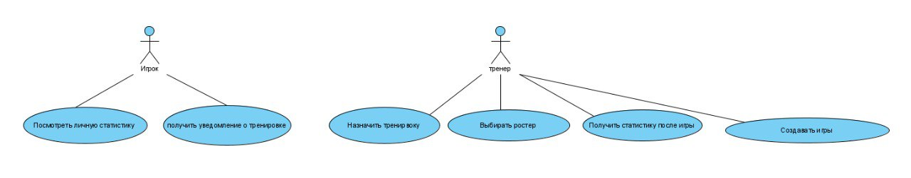
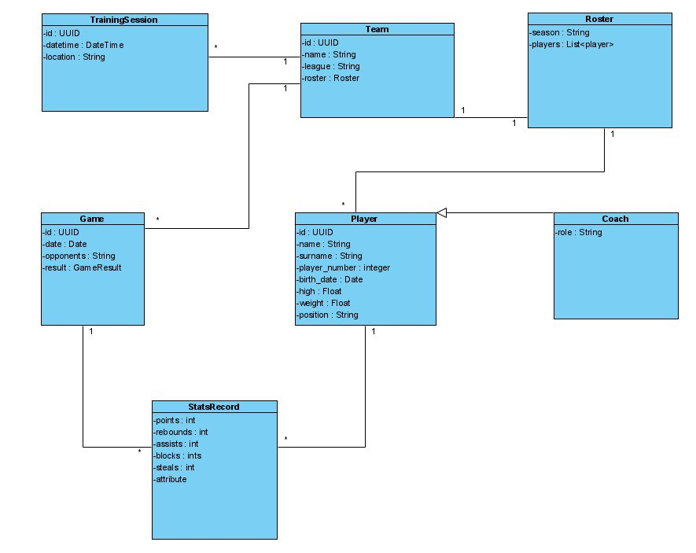

# Basketball Team Management System

> Единая платформа для управления расписанием, играми и статистикой любительской баскетбольной команды.

---

## Зачем нужна система

* **Расписание** тренировок и матчей сейчас хранится в чатах и таблицах — легко потеряться.  
* **Статистика игроков** ведётся вручную, поэтому трудно объективно отслеживать прогресс.  
* **Коммуникация** с командой (уведомления) и публикация результатов разнесены по разным сервисам.  

**Цель проекта** — собрать всё в одном приложении: от планирования тренировок до личного кабинета игрока.

---

## Ключевые функции

| Модуль | Возможности |
|-------|-------------|
| **Игрок** | • Просмотр личной статистики  • Push/мэйл-уведомления о предстоящих тренировках |
| **Тренер** | • Создание/редактирование игр  • Назначение тренировок  • Формирование ростера  • Внесение статистики после матча |
| **Общие** | • Каталог всех игр и тренировок  • Хранение истории статистики  • Возможность расширения (мерч, интеграции с лигой) |

---

## UML-диаграммы

Файлы с диаграммами лежат в каталоге `docs/diagrams/`.  
Ниже представлены готовые изображения и краткие пояснения.

### 1. Диаграмма вариантов использования (Use-Case)

---

### 2. Диаграмма классов (Class)

*Отражает основные сущности домена и их связи: команда агрегирует ростер, тренировки и игры; игрок ассоциирован со статистикой, тренер расширяет сущность «Player».*

# Структура базы данных Basketball DB

Данная база данных предназначена для хранения информации о баскетбольных командах, игроках, тренерах, играх и тренировках.

## Таблицы и их описание

### player
- **id** — уникальный идентификатор игрока (INTEGER PRIMARY KEY)
- **name** — имя игрока (TEXT, NOT NULL)
- **surname** — фамилия игрока (TEXT, NOT NULL)
- **birth_date** — дата рождения (TEXT, формат 'YYYY-MM-DD', NOT NULL)
- **player_number** — игровой номер (INTEGER)
- **height** — рост (REAL)
- **weight** — вес (REAL)
- **position** — игровая позиция (TEXT)

### coach
- **id** — уникальный идентификатор тренера (INTEGER PRIMARY KEY)
- **player_id** — ссылка на игрока, который является тренером (INTEGER, UNIQUE, FOREIGN KEY на player(id), ON DELETE CASCADE)
- **role** — роль тренера (TEXT)

### team
- **id** — уникальный идентификатор команды (INTEGER PRIMARY KEY)
- **name** — название команды (TEXT, NOT NULL)
- **league** — лига, в которой участвует команда (TEXT)

### roster
- **id** — уникальный идентификатор состава (INTEGER PRIMARY KEY)
- **team_id** — ссылка на команду (INTEGER, FOREIGN KEY на team(id), ON DELETE CASCADE)
- **season** — сезон (TEXT, NOT NULL)

### game
- **id** — уникальный идентификатор игры (INTEGER PRIMARY KEY)
- **team_id** — ссылка на команду (INTEGER, FOREIGN KEY на team(id), ON DELETE CASCADE)
- **date** — дата игры (TEXT, формат 'YYYY-MM-DD', NOT NULL)
- **opponents** — соперники (TEXT)
- **result** — результат (TEXT)

### training_session
- **id** — уникальный идентификатор тренировки (INTEGER PRIMARY KEY)
- **team_id** — ссылка на команду (INTEGER, FOREIGN KEY на team(id), ON DELETE CASCADE)
- **datetime** — дата и время тренировки (TEXT, формат 'YYYY-MM-DD HH:MM:SS', NOT NULL)
- **location** — место проведения (TEXT)

### player_roster
- **player_id** — ссылка на игрока (INTEGER, FOREIGN KEY на player(id), ON DELETE CASCADE)
- **roster_id** — ссылка на состав (INTEGER, FOREIGN KEY на roster(id), ON DELETE CASCADE)
- **PRIMARY KEY (player_id, roster_id)**

### stats_record
- **id** — уникальный идентификатор записи статистики (INTEGER PRIMARY KEY)
- **player_id** — ссылка на игрока (INTEGER, FOREIGN KEY на player(id), ON DELETE CASCADE)
- **game_id** — ссылка на игру (INTEGER, FOREIGN KEY на game(id), ON DELETE CASCADE)
- **points** — очки (INTEGER, по умолчанию 0)
- **rebounds** — подборы (INTEGER, по умолчанию 0)
- **assists** — передачи (INTEGER, по умолчанию 0)
- **blocks** — блоки (INTEGER, по умолчанию 0)
- **steals** — перехваты (INTEGER, по умолчанию 0)

### team_coach
- **id** — уникальный идентификатор связи команда-тренер (INTEGER PRIMARY KEY)
- **team_id** — ссылка на команду (INTEGER, FOREIGN KEY на team(id), ON DELETE CASCADE)
- **coach_id** — ссылка на тренера (INTEGER, FOREIGN KEY на coach(id), ON DELETE CASCADE)

---

## Взаимосвязи между таблицами

- Один игрок может быть тренером (coach.player_id — уникальная ссылка на player.id).
- Команда имеет несколько составов (roster) по сезонам.
- Игроки могут входить в составы через таблицу player_roster (многие-ко-многим).
- Каждая игра связана с командой.
- Каждая тренировка связана с командой.
- Записи статистики связаны с игроком и игрой.
- Команды могут иметь нескольких тренеров через team_coach.

##Консольное приложение для управления данными баскетбольной лиги: командами, игроками, тренерами, играми и тренировками.

## Основные команды меню

| №   | Команда                               | Назначение                                                       |
|-----|---------------------------------------|------------------------------------------------------------------|
| 1   | Добавить команду                      | Добавление новой команды в лигу                                  |
| 2   | Добавить игрока                       | Добавление нового игрока                                         |
| 3   | Добавить тренера                      | Добавление нового тренера                                        |
| 4   | Добавить игру                         | Добавление новой игры                                            |
| 5   | Добавить тренировку                   | Добавление новой тренировки                                      |
| 6   | Просмотреть все команды               | Вывод списка всех команд                                         |
| 7   | Просмотреть всех игроков              | Вывод списка всех игроков                                        |
| 8   | Просмотреть всех тренеров             | Вывод списка всех тренеров                                       |
| 9   | Просмотреть все игры                  | Вывод списка всех игр                                            |
| 10  | Просмотреть все тренировки            | Вывод списка всех тренировок                                     |
| 11  | Просмотреть статистику игрока         | Поиск игрока по имени и просмотр его статистики                  |
| 12  | Выход                                 | Завершение работы приложения                                     |

## Особенности

- **Проверка уникальности**: При добавлении команд, игроков, тренеров, игр и тренировок приложение проверяет, нет ли уже такой записи.
- **Проверка существования**: При просмотре информации, если сущности нет в базе, выводится соответствующее сообщение.
- **Обработка ошибок**: Ввод защищён от некорректных значений (например, неверный формат даты, дублирование записей).
- **Интуитивный интерфейс**: Приложение информирует пользователя о результате каждого действия и просит нажать Enter для продолжения.

